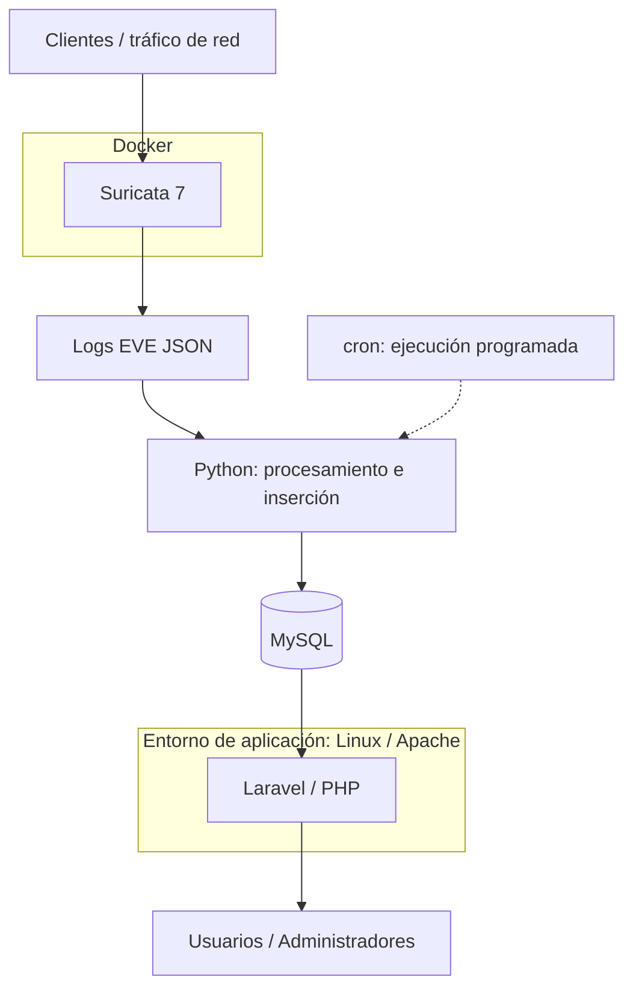

# Arquitectura de Suricata Log Viewer

[Volver al proyecto](../README.md)

El proyecto conecta la detección de eventos de red con su consulta desde una aplicación web. Este diagrama representa el flujo lógico del laboratorio; no especifica una distribución en servidores ni una topología física.

## Recorrido de los eventos

1. Suricata 7, ejecutado en Docker, observa el tráfico y genera logs EVE JSON.
2. Los scripts Python procesan los eventos y los insertan en MySQL. cron programa ese procesamiento.
3. Laravel consulta la base de datos y ofrece filtros, paginación, alertas, notificaciones y exportación a PDF.
4. Los usuarios acceden a la aplicación, desplegada en Linux con Apache. La autenticación, los roles y la asociación de redes organizan el acceso y la gestión.

Las flechas indican el recorrido de la información. La aplicación consulta MySQL; no implican que la base de datos inicie conexiones hacia Laravel.

## Alcance de esta documentación

La arquitectura corresponde al proyecto final de ASIR. No se incluyen direcciones, credenciales ni configuración del laboratorio. El código completo todavía no está publicado; su recuperación y preparación se recogen en el [plan de publicación](PUBLISHING_PLAN.md).
